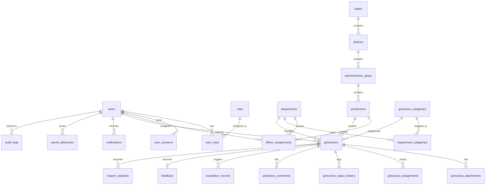

# Entity Relationship Diagram (ERD)

```mermaid
erDiagram
    users ||--o{ user_roles : has
    roles ||--o{ user_roles : assigned_to
    users ||--o{ user_sessions : owns
    users ||--o{ officer_assignments : assigned
    departments ||--o{ officer_assignments : scopes
    jurisdictions ||--o{ officer_assignments : scopes

    states ||--o{ districts : contains
    districts ||--o{ administrative_areas : contains
    administrative_areas ||--o{ jurisdictions : contains

    departments ||--o{ department_categories : owns
    grievance_categories ||--o{ department_categories : mapped_to

    users ||--o{ grievances : submits
    grievance_categories ||--o{ grievances : categorizes
    departments ||--o{ grievances : handles
    jurisdictions ||--o{ grievances : locates

    grievances ||--o{ grievance_attachments : has
    grievances ||--o{ grievance_assignments : tracks
    grievances ||--o{ grievance_status_history : logs
    grievances ||--o{ grievance_comments : has
    grievances ||--o{ escalation_records : triggers
    grievances ||--o| feedback : receives
    grievances ||--o{ reopen_requests : requests

    users ||--o{ notifications : receives
    users ||--o{ saved_addresses : saves
    users ||--o{ audit_logs : performs
```
